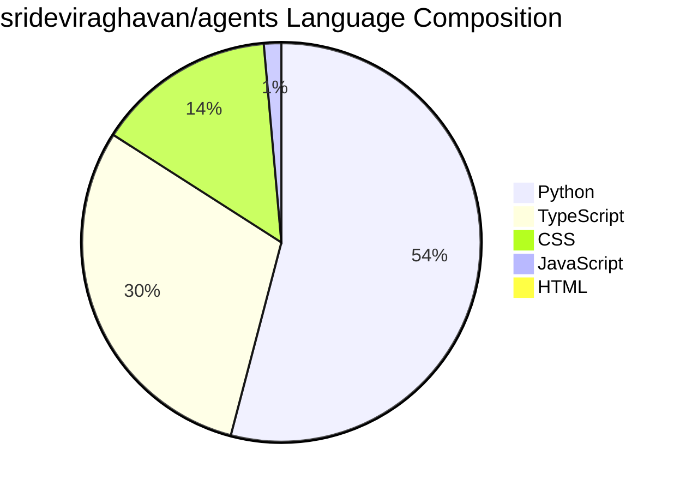
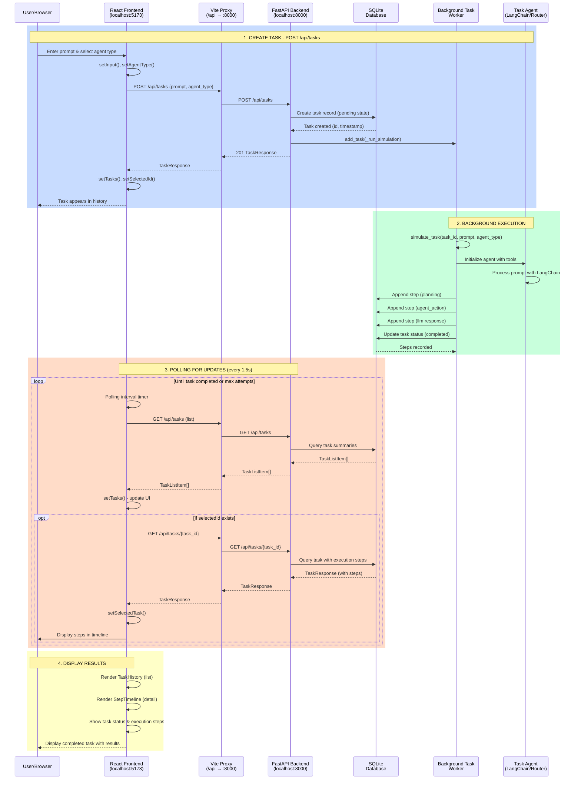

# Repository Language Composition

## Language Distribution

## System Architecture - Request/Response Flow

## Summary

| Language | Percentage |
|----------|-----------|
| Python | 53.6% |
| TypeScript | 29.7% |
| CSS | 14.4% |
| JavaScript | 1.4% |
| HTML | 0.9% |

**Total: 100%**

The repository is primarily written in **Python** (over half the codebase), with a significant TypeScript component (nearly 30%). Styling is handled with CSS, and there are minimal JavaScript and HTML files.

## Architecture Notes

- **Frontend**: React + TypeScript + Vite (proxies `/api` to FastAPI)
- **Backend**: FastAPI + SQLite
- **Agent Layer**: LangChain with configurable agents (Router, Simple, Calculator, Text Processor)
- **Communication**: REST API with polling-based status updates (every 1.5s)
- **Task Execution**: FastAPI BackgroundTasks for async processing
